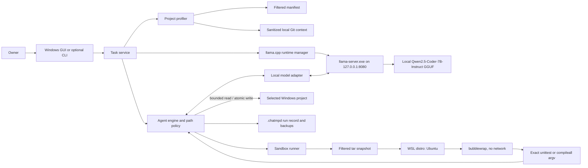

# ChatMPD architecture

This document describes the current ChatMPD 0.1 task path. It is intended to help an owner understand where work happens and to give contributors a canonical reference for implementation boundaries.

## Goals and non-goals

ChatMPD is designed to:

- provide a simple Windows GUI for one local coding task at a time
- use a local llama.cpp server and the official Qwen2.5-Coder-7B-Instruct GGUF model without a paid API or vendor quota
- restrict project execution to one automatically selected Python verification command
- run that verification in a disposable, offline WSL Ubuntu plus bubblewrap snapshot
- protect repository state and known secret locations
- keep local backups and compact task records
- reduce model resource contention while `eso64.exe` is running

ChatMPD is not a general shell, cloud agent, GitHub bot, multi-language build system, perfect sandbox, automatic source-control client, or guarantee of correct code.

## Component map

The important split is that file edits happen in the selected Windows project through ChatMPD's path gate, while verification runs against a filtered copy. A command running in bubblewrap cannot edit the live project because the live project is never mounted there.

## Main components

| Component | Responsibility | Important boundary |
| --- | --- | --- |
| `chatmpd.app` | Routes a double-click/no-argument launch to the GUI and explicit arguments to the CLI. Owns one runtime context per task. | A server started by that context is released when the task exits. |
| `chatmpd.gui` | Collects a project folder and task, runs work on one background thread, and renders a concise outcome. | Rejects blank inputs and prevents two concurrent tasks in the same window. |
| `chatmpd.cli` | Provides optional `doctor`, `run`, and deterministic `demo` commands. | Converts expected failures to bounded messages and stable exit codes. |
| `chatmpd.project` | Builds a safe manifest, selects project support, and collects sanitized Git context. | Excludes links, state, caches, common secret directories, and known credential files. |
| `chatmpd.runtime` | Discovers llama.cpp/model files, selects performance mode, starts and stops an owned process, and checks endpoint identity. | Accepts only plain-HTTP loopback URLs and refuses any endpoint already occupied by another process. |
| `chatmpd.llamacpp` | Sends bounded, non-streaming OpenAI-compatible chat requests to llama.cpp. | Disables proxy use, validates response shapes, and rejects oversized or malformed JSON. |
| `chatmpd.local_model` | Turns model responses into one plan/action at a time. | Exposes only list, read, write, and exact-command tools; requests one tool call per turn. |
| `chatmpd.engine` | Enforces path/command policy, performs atomic writes, creates backups and records, and requires fresh verification. | Protects workspace containment and accepts success only after required checks pass after the last write. |
| `chatmpd.sandbox` | Copies safe project files and runs the approved argv under WSL/bubblewrap. | Uses a temporary snapshot, clears the environment, drops capabilities, unshares networking, and applies time/output/size bounds. |
| `chatmpd.git_context` | Queries repository root, branch, origin identity, status, and diff. | Uses local read-only Git commands with prompts and optional locks disabled; never fetches or mutates Git state. |

## Task path and component behavior

### 1. Input, project preflight, and local model runtime

The GUI passes a chosen project directory and non-empty task to `run_local_task`; its folder chooser normally returns an existing directory. The optional CLI validates that the workspace already exists and the task is non-empty. Both live paths complete `prepare_project_task()`—including workspace resolution, task-size validation, project profiling, Git-context collection, and verification selection—before entering the `LlamaCppRuntime` context. A preflight failure therefore does not start llama.cpp.

`LlamaCppRuntime` discovers:

- `llama-server.exe` on `PATH`, or below the current user's WinGet package directory for `ggml.llamacpp`
- a `Qwen2.5-Coder-7B-Instruct` `Q4_K_M` GGUF, including a complete numbered split, anywhere below `D:\ChatMPD\models\huggingface`

The endpoint defaults to `http://127.0.0.1:8080`. Before starting, ChatMPD checks `/health` and `/v1/models` for diagnostics and the private alias `chatmpd-local`. Any already-healthy service is treated as an endpoint conflict and is neither terminated nor borrowed. A matching alias produces a ChatMPD-specific conflict message but does not transfer process ownership.

The managed server uses an 8,192-token context, a 512-token response cap, a single parallel request, no web UI, and a reduced environment. Output is appended to `%LOCALAPPDATA%\ChatMPD\runtime\llama-server.log`, and the owned process is terminated when the runtime context exits.

Performance mode is selected at startup:

| `eso64.exe` state | llama.cpp configuration |
| --- | --- |
| Detected | CPU only, one inference thread, one batch thread, zero GPU layers, Windows `IDLE_PRIORITY_CLASS`. |
| Not detected | Automatic GPU-layer offload. |
| Detection cannot complete | Conservatively treated as detected: CPU-safe settings and idle priority. |

`--parallel 1` applies in both modes. WSL snapshotting and checks are separate processes and can still use host resources.

### 2. Prepared project context

Before the local endpoint is started, project preflight resolves the directory and rejects task text larger than 32 KiB. Project profiling scans regular files without following symbolic links or Windows junctions. Its initial model manifest is capped at 500 entries. Repository/internal state, build output, virtual environments, caches, and common secret locations are excluded. If local Git is available, ChatMPD runs bounded local queries to obtain:

- repository root
- branch or detached revision
- parsed `owner/repository` identity from the `origin` URL, without credentials or the full URL
- porcelain status
- a small `HEAD` diff with external diff drivers disabled

Sensitive-path entries are removed from status and diff context. When the selected workspace is a repository subdirectory, a top-anchored literal Git pathspec limits status and diff to that subdirectory; selecting the repository root includes the whole repository. Git calls use `GIT_TERMINAL_PROMPT=0`, `GCM_INTERACTIVE=never`, `GIT_OPTIONAL_LOCKS=0`, `--no-optional-locks`, and hidden Windows process flags. There is no fetch, pull, push, commit, checkout, branch creation, or pull-request operation.

### 3. Verification selection

The profiler supports Python only:

- If static AST inspection recognizes a direct `unittest.TestCase` or `unittest.IsolatedAsyncioTestCase` subclass with a `test*` method in a root-level `tests/test*.py` file, the required command is `[/usr/bin/python3, -m, unittest, discover, -s, tests]`.
- Otherwise, if any `.py` file exists, the command is `[/usr/bin/python3, -m, compileall, -q, .]`.
- Without a Python file, the service stops with an unsupported-project error.

That exact list of arguments becomes both the allowlist and required completion gate. The model cannot add flags, choose a package manager, invoke a shell, or request another executable. The allowlisted `unittest` command can import and execute project-supplied Python test code, which is why the WSL/bubblewrap boundary remains essential.

### 4. Model/agent loop

The local model first returns a plan. The engine then permits at most 50 turns. Each action is one of:

- list a bounded project subtree
- read one UTF-8 file
- atomically create or replace one UTF-8 file
- run the one exact verification argv
- finish with success or failure

Path validation rejects absolute paths, `..`, links, junctions, escapes, Windows reserved/alias forms, `.git`, `.chatmpd`, common secret directories, environment files, known credential files, and private key/certificate formats. Lists are bounded to 1,000 files and eight directory levels. Reads, writes, and pre-edit backups are each limited to 256 KiB.

Before replacing an existing file, the engine saves its original bytes once under the run's `backups/` tree. A temporary file plus `os.replace` makes the project replacement atomic on the same filesystem. There is no automatic rollback.

### 5. Offline snapshot verification

The sandbox runner creates a tar archive of regular safe files from the current project state. It does not follow links or junctions and excludes protected state, common secrets, caches, build output, environments, and known credential formats. Defaults are:

- 20,000 files maximum
- 256 MiB total uncompressed file content
- 64 MiB per file

The archive is streamed into the registered WSL distribution named `Ubuntu`. A temporary directory matching `/tmp/chatmpd-sandbox-<random-id>` is created with mode-restrictive defaults and removed on exit. bubblewrap then:

- creates new user, PID, network, IPC, and UTS namespaces
- drops all capabilities
- mounts `/usr`, `/lib`, and `/lib64` read-only
- supplies minimal `/proc` and `/dev`, empty system/home/run directories, and a temporary `/tmp`
- binds only the extracted copy at `/work`
- clears the inherited environment and supplies a small fixed environment
- runs the exact argument vector without a shell around the project command

The command has a 60-second task limit and a 64 KiB combined captured-output budget. A Windows-side timeout and process-tree cleanup provide an outer guard. WSL and the host remain trusted dependencies; the design does not claim virtualization-grade or perfect containment.

### 6. Completion and persistence

The engine records required checks and the sequence number of each write. A success response is rejected unless every required check has exit code zero and occurred after the last write.

Each attempt creates `.chatmpd/runs/<run-id>/` inside the selected project:

- `run.json`: task, status, summary, changed paths, check argv/exit codes/sequences, hashes and byte counts, and event count
- `events.jsonl`: event sequence, timestamps, plan metadata, permission decisions, tool names, write metadata, and hashes/byte counts for reads and command output
- `backups/`: eligible original files, preserving project-relative paths

Raw read contents and raw verification stdout/stderr are available to the in-memory model loop but are not written to the task record. The task and summary are stored as text. Records are local recovery/audit aids, not a secret store and not a transactional rollback journal.

## Failure behavior

- Missing llama.cpp/model files stop the task before model use.
- Any already-healthy process on port `8080`, including another ChatMPD server, causes a refusal instead of takeover or borrowing.
- An unavailable WSL/bubblewrap probe prevents verification and therefore success.
- A bad tool request is reported back to the local model when safe; a permission violation stops the engine.
- A failed or stale required check prevents successful completion.
- Startup timeout, model/provider failure, sandbox rejection, turn exhaustion, and unexpected errors save a failed run record when the run directory already exists.
- Runtime context cleanup attempts to stop only the llama.cpp process it started.

Owner-facing recovery and symptom-specific steps are in [Troubleshooting](troubleshooting.md). The trust model and residual risks are in [Security](security.md).
